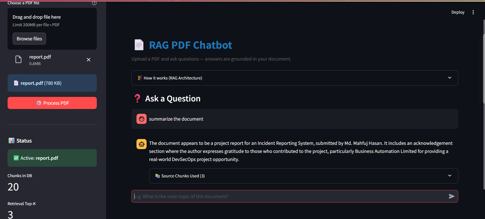

# 📄 RAG PDF Chatbot

> A production-ready Retrieval-Augmented Generation (RAG) chatbot that lets users upload any PDF and ask natural language questions about it. Built with LangChain, ChromaDB, Sentence Transformers, and Groq — 100% free to run.

[](https://python.org)
[](https://langchain.com)
[](https://streamlit.io)
[](LICENSE)

---

## 🎯 What It Does

Upload a PDF → Ask questions → Get accurate, grounded answers with source citations.

The system never hallucinates answers from outside the document — responses are strictly based on retrieved context from your uploaded file.

---

## 🏗️ Architecture

```
┌──────────────────────────────────────────────────────────────────────────┐
│                        RAG PIPELINE                                       │
│                                                                           │
│  INDEXING PHASE (runs once per document):                                 │
│                                                                           │
│   PDF File                                                                │
│      │                                                                    │
│      ▼                                                                    │
│  [pdfplumber]  ──→  Raw Text  ──→  [LangChain Splitter]  ──→  Chunks     │
│  Text Extraction    (full doc)      chunk_size=500             (N × 500c) │
│                                     chunk_overlap=50                      │
│                                           │                               │
│                                           ▼                               │
│                               [Sentence Transformers]                     │
│                               all-MiniLM-L6-v2 model                      │
│                               Embedding (384-dim vectors)                 │
│                                           │                               │
│                                           ▼                               │
│                                    [ChromaDB]                             │
│                               Local Vector Database                       │
│                               (persisted to ./chroma_db)                  │
│                                                                           │
│  RETRIEVAL + GENERATION PHASE (runs per query):                           │
│                                                                           │
│   User Question                                                           │
│      │                                                                    │
│      ▼                                                                    │
│  [Sentence Transformers]  ──→  Query Vector  ──→  [ChromaDB]             │
│  Same embedding model           (384-dim)         Cosine Similarity       │
│                                                   Top-3 Chunks            │
│                                                        │                  │
│                                                        ▼                  │
│                                               [Groq LLM API]             │
│                                            llama3-8b-8192 model           │
│                                    Prompt = Context Chunks + Question      │
│                                                        │                  │
│                                                        ▼                  │
│                                              Grounded Answer              │
│                                          + Source Chunk Display           │
└──────────────────────────────────────────────────────────────────────────┘
```

---

## ✨ Features

- **PDF Upload** — Streamlit UI with drag-and-drop PDF upload
- **Smart Text Extraction** — pdfplumber with PyPDF2 fallback for maximum compatibility
- **Intelligent Chunking** — Recursive character splitting with overlap to preserve context at boundaries
- **Local Embeddings** — Sentence Transformers `all-MiniLM-L6-v2` runs on your machine (no API key, no cost)
- **Persistent Vector Store** — ChromaDB saves embeddings locally; re-uploads don't re-embed
- **Semantic Search** — Cosine similarity retrieval finds relevant chunks by meaning, not just keywords
- **Fast LLM Answers** — Groq's llama3-8b-8192 delivers answers at ~400 tokens/second (free tier)
- **Source Transparency** — Every answer shows the exact document chunks it was based on
- **Chat History** — Last 5 exchanges displayed with conversational context
- **Grounded Responses** — LLM is instructed to only answer from retrieved context, preventing hallucinations

---

## 🛠️ Tech Stack

| Component | Technology | Purpose |
|-----------|------------|---------|
| Frontend | Streamlit 1.35 | Web UI, file upload, chat interface |
| Orchestration | LangChain 0.2.5 | Text splitting pipeline |
| PDF Parsing | pdfplumber + PyPDF2 | Text extraction with fallback |
| Embeddings | Sentence Transformers | Local, free embedding model |
| Embedding Model | all-MiniLM-L6-v2 | 384-dim semantic vectors (~80MB) |
| Vector DB | ChromaDB 0.5.3 | Local similarity search |
| LLM | Groq API (llama3-8b-8192) | Fast, free answer generation |
| Env Management | python-dotenv | Secure API key handling |

---

## 🚀 Quick Start

### Prerequisites
- Python 3.10 or higher
- A free Groq API key (see below)

### 1. Clone the Repository
```bash
git clone https://github.com/YOUR_USERNAME/rag-chatbot.git
cd rag-chatbot
```

### 2. Create a Virtual Environment
```bash
python -m venv venv

# Windows
venv\Scripts\activate

# macOS / Linux
source venv/bin/activate
```

### 3. Install Dependencies
```bash
pip install -r requirements.txt
```
> ⚠️ First install takes 2–5 minutes. Sentence Transformers downloads ~80MB model on first run.

### 4. Set Up Your API Key
```bash
# Copy the example env file
cp .env.example .env

# Open .env and add your Groq key
# GROQ_API_KEY=gsk_your_key_here
```

**Getting a free Groq API key:**
1. Go to [https://console.groq.com](https://console.groq.com)
2. Sign up with Google or email (free, no credit card)
3. Click **API Keys** → **Create API Key**
4. Copy the key (starts with `gsk_...`) and paste into your `.env` file

### 5. Run the App
```bash
streamlit run app.py
```

The app opens automatically at `http://localhost:8501`

---

## 📖 How to Use

1. **Upload a PDF** — Click "Browse files" in the sidebar and select any PDF
2. **Process** — Click "⚙️ Process PDF" and wait for indexing to complete (10–60 seconds depending on PDF size)
3. **Ask Questions** — Type a question in the chat input at the bottom
4. **View Sources** — Expand "📚 Source Chunks Used" under any answer to see exactly which parts of the document were used

---

## 💡 Sample Questions to Test

After uploading a document, try:

1. *"What is the main topic or purpose of this document?"*
2. *"Summarize the key points discussed in this document."*
3. *"What conclusions or recommendations does the document make?"*
4. *"Who is the intended audience for this document?"*
5. *"What data or evidence is presented to support the main argument?"*

---

## 📂 Project Structure

```
rag-chatbot/
├── app.py                  # Streamlit UI + main pipeline orchestration
├── rag/
│   ├── __init__.py         # Package marker
│   ├── pdf_loader.py       # PDF text extraction (pdfplumber + PyPDF2)
│   ├── chunker.py          # LangChain RecursiveCharacterTextSplitter
│   ├── embedder.py         # Sentence Transformers embedding generation
│   ├── vector_store.py     # ChromaDB store/query operations
│   └── llm.py              # Groq API integration + RAG prompt builder
├── data/                   # Uploaded PDFs (git-ignored)
├── chroma_db/              # ChromaDB persistence directory (git-ignored)
├── requirements.txt        # Python dependencies
├── .env.example            # Environment variable template
├── .gitignore
└── README.md
```

---

## ⚙️ Configuration

| Parameter | Default | File | Description |
|-----------|---------|------|-------------|
| `chunk_size` | 500 | `app.py` | Characters per text chunk |
| `chunk_overlap` | 50 | `app.py` | Shared characters between chunks |
| `TOP_K_CHUNKS` | 3 | `app.py` | Chunks retrieved per query |
| `MAX_HISTORY` | 5 | `app.py` | Chat turns displayed |
| `TEMPERATURE` | 0.2 | `rag/llm.py` | LLM response creativity (0=focused) |
| `MAX_TOKENS` | 1024 | `rag/llm.py` | Max response length |
| `MODEL_NAME` | all-MiniLM-L6-v2 | `rag/embedder.py` | Embedding model |
| `GROQ_MODEL` | llama3-8b-8192 | `rag/llm.py` | LLM model |

---

## 🌐 Deployment (Free on Streamlit Cloud)

1. Push this project to a **public GitHub repository**
2. Add a `secrets.toml` for Streamlit Cloud:
   - In your GitHub repo, do NOT commit your `.env` file
3. Go to [https://share.streamlit.io](https://share.streamlit.io)
4. Click **New app** → select your repository → set **Main file:** `app.py`
5. Click **Advanced settings** → add secret:
   ```
   GROQ_API_KEY = "gsk_your_key_here"
   ```
6. Click **Deploy** — your app goes live at `https://your-app.streamlit.app`

> Note: Streamlit Cloud's free tier resets the ChromaDB on each restart (ephemeral filesystem). The PDF embedding happens fresh each session, which is fine for a demo.

---

## 🧠 RAG Concepts Explained

**Why chunk documents?**
LLMs have a context window limit (8,192 tokens for llama3-8b). A 50-page PDF has ~50,000+ tokens. We split it into small chunks and only send the most relevant ones.

**Why embeddings?**
Embeddings convert text into numbers that capture meaning. "Dog" and "canine" have similar embeddings even though they're different words. This enables semantic search — finding chunks by meaning, not exact words.

**Why cosine similarity?**
We measure how "close" two vectors are in 384-dimensional space. Closer = more semantically similar. The top-3 closest chunks to your question vector are retrieved.

**Why Groq?**
Standard LLM APIs (OpenAI) are slow (~30-50 tokens/sec) and cost money. Groq uses custom hardware (LPUs) to deliver 300-500 tokens/sec for free.

---

## 📸 Screenshots



| PDF Upload | Q&A Interface |
|------------|--------------|
|  |  |

---

## 📄 License

MIT License — free to use, modify, and distribute.

---

## 🙏 Acknowledgments

- [LangChain](https://langchain.com) for the text splitting utilities
- [Sentence Transformers](https://sbert.net) for the free embedding model
- [ChromaDB](https://trychroma.com) for the simple local vector database
- [Groq](https://groq.com) for the blazing-fast free LLM API
- [Streamlit](https://streamlit.io) for the rapid UI framework
